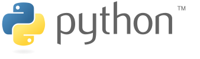
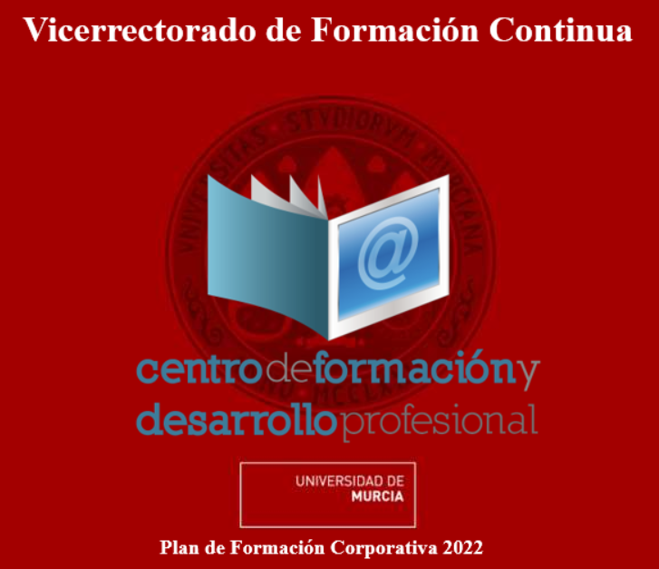

## **Curso Python para Matematicos. Nivel Intemedio.**

 

Bienvenidos al curso continuación del realizado en Marzo y Abril del 2022, con el título **"INTRODUCCIÓN A PYTHON PARA MATEMÁTICOS"**, impartido por D.Luis Daniel Hernández Molinero. Universidad de Murcia.

Este nuevo curso se realizará entre el **2 y el 10 de nobiembre de 2022** de manera presencial, con el horario **(16:30 a 19:00)**, más información en ["Motivación del curso"](./extras/Motivacion.md)

La idea principal del curso, es aumentar el conocimiento sobre el lenguaje Python y la utilización de las librerias principales para trabajar dentro de un ámbito matemático. Se hará un repaso desde un nivel básico hasta un nivel intermedio de python, con la idea de que este repositorio sirva como consulta de dudas y trucos para los alumnos inscritos.

Personal formador: [Ignacio Martínez Soriano](https://www.linkedin.com/in/imsoriano/)

Nota: **Las herramientas y notebooks principales de este curso han sido clonadas del repositorio:** [Grupo Python Cientifico de la Universidad de Concepción CPC21](https://github.com/PythonUdeC/CPC21), del curso **"Introducción a la Programación en Python"**. Además se ha utilizado la documentación de la web (https://aprendeconalf.es/) del Profesor **D.Alfredo Sánchez Alberca**, Universidad CEU San Pablo. 
Se han adaptado al enfoque específico de este nuevo curso.

-------------
## Indice de Materias:
| Materias                                 |
|------------------------------------------|
| [1. Introducción al Python](./extras/00-Introduccion-Python.md) |
| [2. Instalación de Python y entornos virtuales](./extras/01-Instalacion-Python.md)|
| [3. Programación en Python - Notebook](./notebooks/01-Programacion-en-Python.ipynb) | 
| [4. Numpy - Notebook](./notebooks/02-NumPy.ipynb)|
| [5. Pandas - Notebook](./notebooks/03-Pandas.ipynb)|
| [6. Matplotlib - Notebook](./notebooks/04-Matplotlib.ipynb)|
| [7. Seaborn - Notebook](./notebooks/04.1-Extras-Seaborn_v1.ipynb)|
| [8. Scipy - Notebook](./notebooks/05-Scipy.ipynb)
| [9. Simpy - Notebook](./notebooks/06-Sympy.ipynb) |
| 10. Extras: (Bokeh) |

-------------
## Horario:

El horario de actividades es el siguiente:
| Horario                                  | Secciones     | Ejecutar en Colab |
|------------------------------------------|---------------|-------------------|
| * Miercoles (02 Noviembre). 16:30 - 19:00 |[Introducción Python](./extras/00-Introduccion-Python.md)||
| | [Instalación](./extras/01-Instalacion-Python.md)||
| | [Programacion con python](./notebooks/01-Programacion-en-Python.ipynb) ||
| * Jueves (03 Noviembre). 16:30 - 19:00    |[Libreria Numpy]((./notebooks/02-NumPy.ipynb))  ||
| | [Libreria - Pandas](./notebooks/03-Pandas.ipynb)||
| * Martes (08 Noviembre). 16:30 - 19:00    |[Libreria Matplotlib](./notebooks/04-Matplotlib.ipynb) | |
| |[Libreria Seaborn](./notebooks/04.1-Extras-Seaborn_v1.ipynb)||
| * Jueves (10 Noviembre). 16:30 - 19:00    | 
Cómputo y simulacion científica:
[Scipy](./notebooks/05-Scipy.ipynb) | |
| |[Simpy](./notebooks/06-Sympy.ipynb) ||

----------------------
## Enlaces de Interés y Bibliografía:
* [Libro Online **Aprende Python**.](https://aprendepython.es/) | [Descarga el pdf](https://aprendepython.es/_downloads/907b5202c1466977a8d6bd3a2641453f/aprendepython.pdf)
* [Blog Noticiero Cientifico](https://astrojuanlu.substack.com/)
* [Kaggle Tutorial Python](https://www.kaggle.com/learn/python) | [Cursos ciencia de datos en Kaggle](https://www.kaggle.com/learn)
* **Cheatsheets:**
    * [Atajos Jupyter Notebook](./docs/jorgejuan007_jupyter-notebook-atajos-de-teclado.pdf)
    * [Python Web](https://www.pythoncheatsheet.org/) | [Python - pdf](.docs/Python-3-Cheat-Sheet-v3.pdf)
    * [Numpy](./docs/Numpy_Python_Cheat_Sheet.pdf)
    * [Pandas](./docs/Pandas_Cheat_Sheet.pdf)
    * [Matplotlib](./docs/Matplotlit-cheatsheets-1.pdf)
    * [Seaborn](./docs/Python_Seaborn_Cheat_Sheet.pdf) | [Ejemplos Seaborn](./docs/seaborn_cheat_sheet.pdf)
    * [Scipy](./docs/Scypy-Cheatsheet.pdf)
    * [Simpy](./docs/Simpy-Cheatseet_v1.pdf) | [Simpy - extenso](.docs/Simpy-Cheatseet_v2.pdf)
    

## Licencia
[Creative Commons Attribution 3.0 Unported License](http://creativecommons.org/licenses/by/3.0/deed.es)

