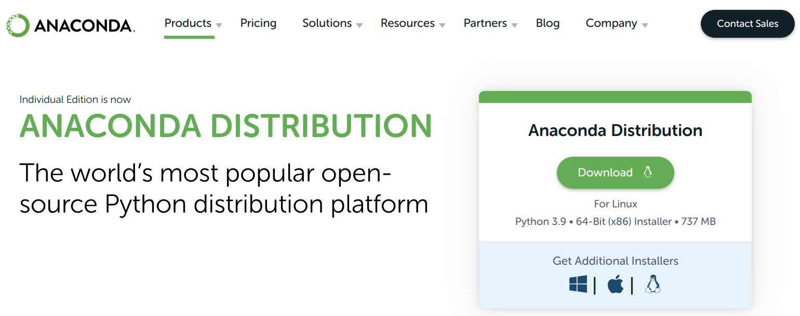
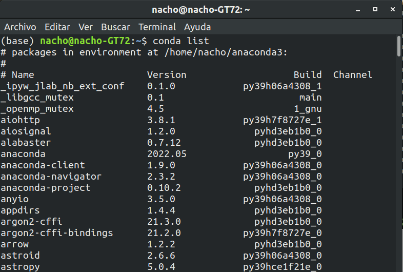
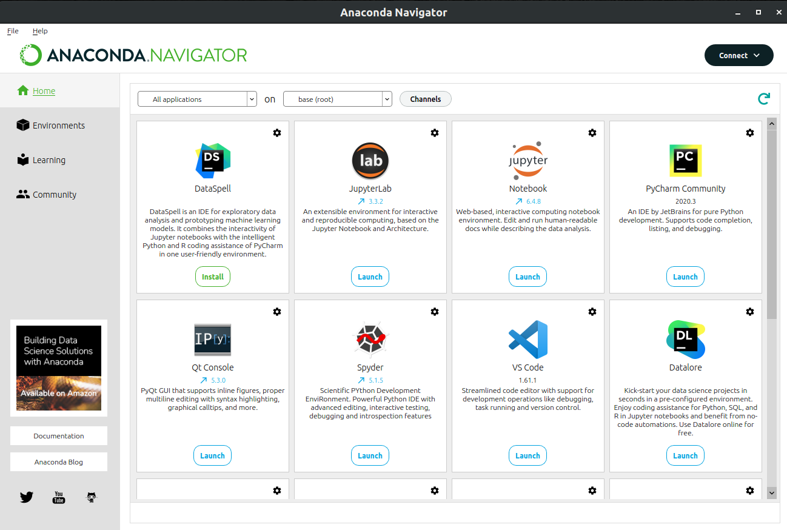

# **Introducción al Curso:**
Este curso pretende pretende dar una visión de las herramientas existentes para poder realizar cálculo científico y ciencia de datos.
Por ello se centra en las herramientas o librerias principales que se utilizan para este tipo de análisis.
Aportando una visión de **Python**, con un enfoque más matemático y de nivel intermedio.

A continuación se detalla los pasos necesarios para el seguimiento del curso.

## **Instalacion Anaconda:**
Instalación del paquete Anaconda:
1. Descarga: desde la web de anaconda.(https://www.anaconda.com/products/distribution)

Una vez instalado se puede ejecutar de varias maneras:

1. Icono *Anaconda Navigator*: Carga el entorno gráfico de anaconda.

    2.1 Desde Consola: anaconda-navigator
    
1. **Anaconda prompt**: se accede un terminal con las variables de entorno y unentorno virtual ya configurado por defecto (base).

    3.1 `$ jupyter lab`: Lanza el entorno de desarrollo de jupyter lab
    
    3.2 `$ jupyter notebook`: Lanza directamente la posibilidad de trabajar con los jupyter notebooks

### **Conda**

Es un sistema de gestión de entornos y paquetes de código abierto que se ejecuta en Windows, macOS y Linux. Conda instala, ejecuta y actualiza rápidamente los paquetes y sus dependencias. También crea, guarda, carga y cambia fácilmente entre entornos en su computadora local. Fue creado para programas de Python, pero puede empaquetar y distribuir software para cualquier idioma.

### **Anaconda Navigator**
La aplicación de escritorio le permite administrar fácilmente aplicaciones, paquetes y entornos integrados sin usar la línea de comandos.

## **Configuración entorno virtual:**

Cuando se trabaja con python normalmente se utiliza la versión más reciente. Sin embargo cuando estas trabajando con varios proyectos, puede ser que se necesite una versión distinta a l aactual, no solo para los paquetes sino para el runtim de python.

También, a veces, ciertos paquetes necesitan versiones concretas de Python o de ciertos paquetes, incluso más antiguas que la que está disponible en un momento dado.

Todo esto hace que gestionar todo en un solo entorno de Python o conda sea complicado y propenso a problemas.
Para solventar este problema están los **entornos de conda**.

### **Cómo crear y activar entornos de conda**
Por defecto conda crea un entorno que se llama **base**, y que contiene la versión base de Python y los paquetes que necesita para funcionar todo bien.

**Puedes ver los entornos que tienes creados en tu equipo con:**

* `conda env list`

Y podemos añadir un nuevo entorno con la instrucción:

* `conda create --name prueba`

Esto crea un nuevo entorno llamado **prueba** que está vacío y que utiliza la misma versión de Python que el entorno de base. No llega con crearlo, sino que **tenemos que activarlo** para poder usarlo, lo cual se hace con:

* `conda activate prueba`

Si ahora listamos nuestros entornos veremos que antes del nuevo entorno aparece un asterisco *, esto indica que es el **entorno activo** sobre el que estamos trabajando.

Ahora mismo ya podríamos instalar paquetes de Python aquí, y quedarían instalados en este entorno sin interferir con otros entornos, incluyendo el base.

* `conda deactivate`
Para salir de un entorno y volver al base hay que usar **conda deactivate**. Si lo aplicamos y volvemos a listar los entornos, veremos que el entorno activo ahora es el base.

### **Crear entornos con versiones específicas de Python**

Aparte de aislar los paquetes para que no haya interferencias otro de los grandes beneficios de usar entornos en conda es que podemos crearlos con versiones específicas de Python, incluso de **Python 2**, que pueden ser muy viejos. Esto nos da una gran flexibilidad a la hora de trabajar.

Por ejemplo, con esta instrucción creamos un entorno con la versión 2.7 de Python:

* `conda create -n py27 python:2.7`

Donde **-n** es la versión abreviada de **--name**, py27 es el nombre que le he dado y con **python:2.7** especifico la versión que me interesa tener en este entorno.

Llegados a este punto, es posible que conda nos pida instalar paquetes y bibliotecas concretas, quizá más antiguas, para poder dar soporte a esa versión.

Si se da este caso, conda nos lo listará y simplemente tendremos que aceptar para instalarlos. Estos paquetes solo estarán disponibles en este entorno.

Para verificar que se ha instalado la versión correcta activamos el entorno:

* `conda activate py27`

y comprobamos la versión con:

* `python --version`

También podremos verificar los paquetes instalados con `conda list`.

### **Eliminar un entorno de conda**
Para eliminar un entorno de conda tenemos que desactivarlo primero si es que estamos dentro:

* `conda deactivate`

y luego lo eliminamos con:

* `conda remove --name py27 --all`

### **Cómo instalar paquetes Python con conda**
En primer lugar nos cambiamos a "pruebas" para no trabajar sobre el entorno:

* `conda activate prueba`

Vamos a recordar la versión de Python que teníamos, ya verás por qué:

* python --version

y listamos los paquetes con `conda list` para comprobar qué tenemos instalado, que en este caso será ninguno.

Ahora, por ejemplo, vamos a instalar el paquete **pandas** en nuestro entorno (en el entorno base ya lo tienes por defecto):

* `conda install pandas`

### **Instalar todas las dependencias de un proyecto**
En conda podemos instalar varios paquetes a la vez simplemente poniendo sus nombres (y también versiones si nos interesa) justo a continuación. Por ejemplo:

* `conda install numpy pandas matplotlib`

Otra opción sería crear un archivo **requirements.txt** donde escribamos a mano el nombre de cada dependencia (uno por línea):

numpy==numero.de.version
pandas>=nmero.de.version
matplotlib

Y ahora podría instalarlo con:

* `conda install --file requirements.txt`

### **Exportar entornos de conda**
Para exportar el entorno, primero nos aseguramos de que estamos trabajando sobre el entorno que nos interese y escribimos la siguiente instrucción:

* `conda env export > environment.yml`

Este comando lo que hace es **exportar todos los datos relativos al entorno** en el que estamos trabajando en un archivo **.yml**, un archivo de texto plano.

Además, si usamos el nombre **environment.yml**, conda reconocerá este nombre, lo que nos será de mucha ayuda al clonarlo.

Por ejemplo, podemos recrear exactamente ese entorno en otro nuevo con:

* `conda env create -f environment.yml`

Pero si ya estamos dentro de una carpeta que tiene ese archivo, lo usará automáticamente para instalar las dependencias porque reconocerá el nombre del archivo. Pero de todas formas es mucho mejor si se lo indicamos.

También podemos instalarlas en el entorno actual con:

* `conda env update -f .\environment.yml`

### Otra forma de exportar el entorno:

`$ conda list -e > req.txt`
Luego puede instalar el entorno usando

`$ conda create -n new environment --file req.txt`

## Ejecutar notebooks:

Podemos utilizar `Jupyter Lab` o `jupyter notebook` para ejecutar el entorno con la interface gráfica. Lo normal es colocarse en el directorio donde se encuentra el proyecto y ejecutar alguno de los comandos anteriores.

## Notebooks del Curso:

|Notebooks | Ejecución online| Visualizar curso online|
|----------|-----------------|------------------------|
|[00-Bienvenida e Introducción](https://github.com/NachusS/Curso-Python-para-Matematicos-Nivel-Intermedio/blob/main/notebooks/00-Computacion-Cientifica-con-Python.ipynb)| ||
|[01-Introduccion-a-la-Programacion-en-Python(opcional)](https://github.com/NachusS/Curso-Python-para-Matematicos-Nivel-Intermedio/blob/main/notebooks/01-Introduccion-a-la-Programacion-en-Python.ipynb)|||
|[02-Clases-y-modulos (opcional)](https://github.com/NachusS/Curso-Python-para-Matematicos-Nivel-Intermedio/blob/main/notebooks/02-Clases-y-modulos.ipynb)|||
|[03-NumPy](https://github.com/NachusS/Curso-Python-para-Matematicos-Nivel-Intermedio/blob/main/notebooks/03-NumPy.ipynb)|||
|[04-Pandas](https://github.com/NachusS/Curso-Python-para-Matematicos-Nivel-Intermedio/blob/main/notebooks/03-NumPy.ipynb)|||
|[05-Matplotlib](https://github.com/NachusS/Curso-Python-para-Matematicos-Nivel-Intermedio/blob/main/notebooks/04-Matplotlib.ipynb)|||
|[06-Scipy](https://github.com/NachusS/Curso-Python-para-Matematicos-Nivel-Intermedio/blob/main/notebooks/05-Scipy.ipynb)|||
|[07-Extras (Seaborn - Bokeh)](https://github.com/NachusS/Curso-Python-para-Matematicos-Nivel-Intermedio/blob/main/notebooks/05-Scipy.ipynb)|||
|[08-Procesamiento_datos](https://github.com/NachusS/Curso-Python-para-Matematicos-Nivel-Intermedio/blob/main/notebooks/06-Procesamiento_datos.ipynb)|||
|[09-Sympy](https://github.com/NachusS/Curso-Python-para-Matematicos-Nivel-Intermedio/blob/main/notebooks/07-Sympy.ipynb)|||

